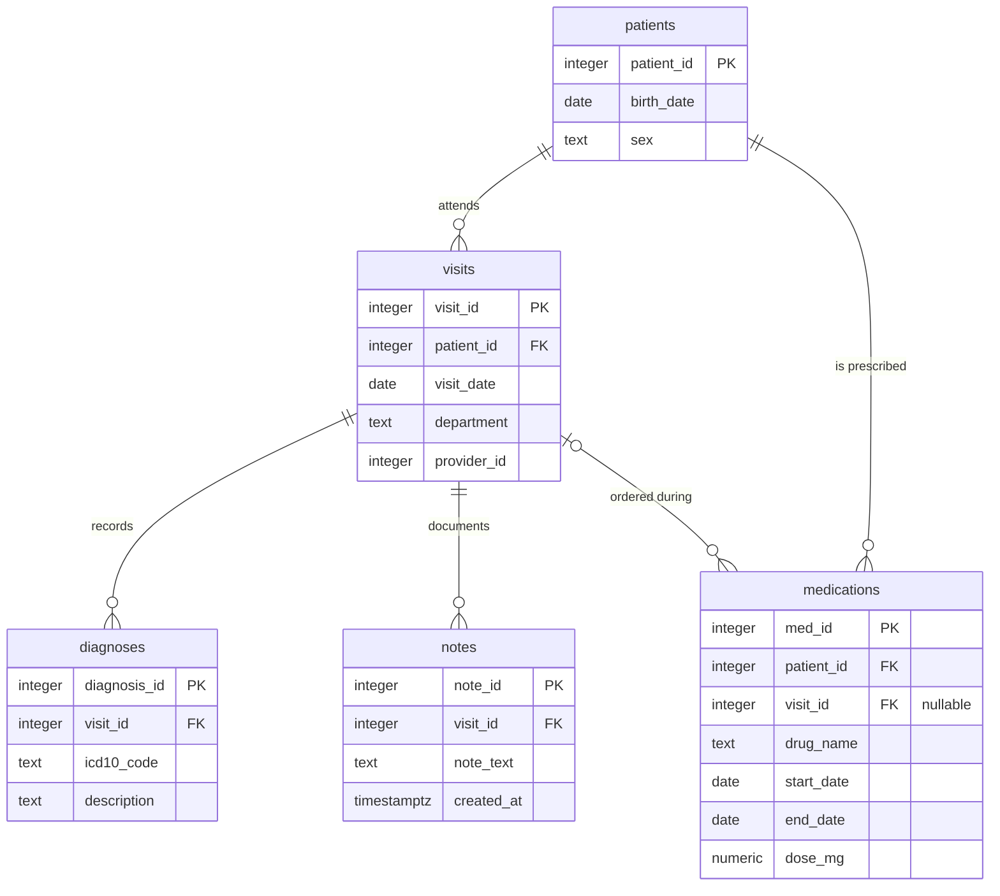

# Part 3 — SQL & Python Pipeline

<!-- ---------------------------------------------------------------------------
COMMENTS TO CLAUDE

Mark feedback inline, next to whatever it refers to, in this form:

    > **@claude:** rewrite this, it repeats the point above

Use `@claude` and nothing else — a different marker will be missed by the sweep:

    grep -n '@claude' results/*.md

These HTML comment blocks do not render, so they stay out of the submitted PDF.
---------------------------------------------------------------------------- -->

---

## Task 3.1 — SQL

### Entity-relationship diagram



DDL: [`sql/schema.sql`](../sql/schema.sql).

### Three things the diagram makes visible

**1. `medications` has two parents.** It carries both `patient_id` and `visit_id`, so it
hangs off `patients` directly *and* off `visits`. That is a deliberate denormalisation —
it lets a prescription exist without an encounter (a phone renewal, a transferred
medication list) by leaving `visit_id` NULL. It also creates a consistency hazard the
schema cannot enforce: nothing stops `medications.patient_id` disagreeing with
`visits.patient_id` for the same row. In production that wants either a composite foreign
key or a `CHECK` trigger. **It changes query 3**: "never prescribed" must be evaluated
through `medications.patient_id`, because joining via `visit_id` would silently miss every
prescription with a NULL visit.

**2. Diagnoses and notes hang off the *visit*, not the patient.** So any patient-level
question about diagnoses has to travel `patients → visits → diagnoses`. A patient with no
visits therefore has no diagnoses by construction, and patient-level counts are only as
complete as the visit records.

**3. There is no encounter-level uniqueness on `notes`.** Nothing prevents several notes
per visit, which is exactly the duplication query 5 has to resolve. The absence of a
constraint is the reason the query is needed.

### The queries

| # | Question | File |
| --- | --- | --- |
| 1 | Distinct patients with ≥1 Neurology visit in 2025 | [`01_neurology_patients_2025.sql`](../sql/queries/01_neurology_patients_2025.sql) |
| 2 | Each patient's first-ever visit date and its department | [`02_first_visit_per_patient.sql`](../sql/queries/02_first_visit_per_patient.sql) |
| 3 | G20 patients never prescribed a levodopa-containing drug | [`03_parkinsons_without_levodopa.sql`](../sql/queries/03_parkinsons_without_levodopa.sql) |
| 4 | Average diagnoses per visit, by department, 2025 | [`04_avg_diagnoses_per_visit_2025.sql`](../sql/queries/04_avg_diagnoses_per_visit_2025.sql) |
| 5 | Exactly one row per visit: the most recent note | [`05_latest_note_per_visit.sql`](../sql/queries/05_latest_note_per_visit.sql) |

Each file carries its own assumptions in a header comment. The ones that change the answer
rather than merely restating it:

**Query 1 — half-open date range.** `>= '2025-01-01' AND < '2026-01-01'` rather than
`BETWEEN '2025-01-01' AND '2025-12-31'`. The `BETWEEN` form is correct for a `date` column
but silently drops 31 December after midnight if the column is ever widened to a timestamp,
and the half-open form stays index-sargable. Department is matched exactly, because
`ILIKE '%neurolog%'` would also capture *Neurosurgery*.

**Query 2 — "every patient" is read literally.** A patient with no visits appears with
NULLs, via `LEFT JOIN LATERAL … LIMIT 1`. A `GROUP BY` over `visits` would silently drop
them and quietly answer a different question: "every patient *who has visited*". Ties on
`visit_date` break to the lower `visit_id`, so the result is deterministic — without a
tie-break, two visits on one day make the returned department arbitrary.

**Query 3 — `LIKE 'G20%'`, not `= 'G20'`.** ICD-10-CM split G20 into subcodes (G20.A1,
G20.B2, …) from FY2024, so an exact match silently misses patients coded under the newer
scheme. No sibling code shares the prefix, so this cannot over-match. *Stated limitation:*
`ILIKE '%levodopa%'` catches `Carbidopa-Levodopa` and `levodopa/benserazide` but **not**
brand names — `Sinemet`, `Madopar`, `Rytary`. The query therefore **over-reports**: a
patient on Sinemet appears untreated. A production version would resolve `drug_name`
against RxNorm ingredients or ATC N04BA instead of matching substrings. There is a test
pinning this behaviour, so switching to terminology matching will fail it and force the
note to be updated rather than left stale.

**Query 4 — visits with zero diagnoses stay in the denominator.** This is the whole
question. An `INNER JOIN` computes "diagnoses per visit *that had a diagnosis*", inflating
every department's average. The `LEFT JOIN` keeps the visit and contributes 0 to the
numerator. The `::numeric` cast prevents integer division truncating 3/2 to 1.

**Query 5 — ties on `created_at` break to the highest `note_id`.** Not a pedantic detail:
duplicate rows carrying *identical* timestamps is precisely the shape of a double-submit
bug, so ties are likely rather than hypothetical. `DISTINCT ON` is used as the idiomatic
PostgreSQL form, with a portable `ROW_NUMBER()` equivalent in the file's footer.

### Unit tests

[`tests/test_sql_queries.py`](../tests/test_sql_queries.py) — 20 tests, run against a real
PostgreSQL cluster. The tests target boundaries rather than happy paths, because that is
where a plausible-looking query is wrong: visits on 31 December vs 1 January, a patient with
no visits, a visit with no diagnoses, a prescription with a NULL `visit_id`, same-day visit
ties, identical note timestamps, and `Neurosurgery` not matching `Neurology`.

Two tests exist to pin decisions rather than to check correctness:
`test_integer_division_does_not_truncate` (3/2 must be 1.5) and
`test_known_limitation_brand_names_are_missed`, which asserts the documented over-report so
it cannot drift silently.

**How they run.** [`tests/conftest.py`](../tests/conftest.py) starts a throwaway cluster
with `initdb` in a temp directory, on a Unix socket only — no Docker, no port collisions,
and no pre-existing server required. Each test gets the schema applied inside a transaction
that is rolled back afterwards; since DDL is transactional in PostgreSQL, isolation is free.
If the PostgreSQL binaries are not on `PATH`, these tests **skip with a clear reason**
rather than failing, so the rest of the suite stays green on a machine without PostgreSQL.

```
uv run pytest tests/test_sql_queries.py -v
```

---

## Task 3.2 — Python evaluation pipeline

[`src/evaluate.py`](../src/evaluate.py) · run with `uv run python -m src.evaluate`
· tests: [`tests/test_evaluate.py`](../tests/test_evaluate.py) (21)

EDA first, as a prerequisite rather than a formality: [`results/eda_report.md`](eda_report.md)
· [`src/eda.py`](../src/eda.py). The finding that shaped the implementation is that **68.9% of
the corpus contains no disease-status vocabulary at all**, so the abstention path is the common
case here, not an edge case.

### What the pipeline does

| Step | Function | Notes |
| --- | --- | --- |
| Random ground truth | `add_random_labels` | Seeded; `pd_prevalence=0.05` to match Q1.2c, which the EDA found realistic for this corpus. `missing_rate` injects NaN labels so the 3.3 path is exercised, not just described. |
| Mock the model | `call_local_llm(text) -> dict` | The signature the assignment specifies. Deterministic per note. Confidence is drawn on the **0–100** scale used from Part 2.2 onward. |
| Mock *messy* output | `call_local_llm_messy(text) -> str` | Fenced blocks, leading/trailing prose, truncation, invalid JSON, out-of-range confidence, unknown fields — drawn at fixed probabilities. |
| Parse and validate | `verify_output` (Part 2) | Reuses the Part-2 validator rather than reimplementing it. |
| Evaluate | `evaluate` | Confusion matrix, PD-class precision/recall/F1, ROC-AUC, bootstrap CIs, coverage. |

**Why there are two mocks.** A mock that only ever returns a clean dict cannot test the parser,
and robust parsing is explicitly assessed. `call_local_llm` satisfies the required signature;
the pipeline calls `call_local_llm_messy` so the failure paths genuinely execute and appear in
the tally. The mock also draws *real substrings* of each note as evidence quotes — an invented
quote would fail the grounding check for the wrong reason and tell us nothing.

### Two bugs found by running it

Both were real defects in this pipeline, caught by executing it rather than by reading it.

**1. Abstentions were being scored as near-certain PD.** `confidence_score` is confidence in
*whichever* label was chosen, so P(PD) for a Non-PD prediction is `1 − confidence`. But the D13
abstention signature is `Non-PD` with a **low** confidence, meaning "the note says nothing" —
which that formula turns into `1 − 0.1 = 0.9`, i.e. "almost certainly PD". With ~69% of the
corpus abstaining, this single sign error dominated the ranking and drove **ROC-AUC to 0.079
(95% CI [0.007, 0.177]) against random labels** — a value chance cannot produce, which is what
made it visible. Fixed by scoring an abstention as a constant `UNINFORMATIVE_SCORE = 0.5`, so
abstentions tie and contribute no discrimination in either direction. That is the honest
encoding of "no evidence".

**2. The pipeline was not reproducible.** The per-note seed was `abs(hash(text))`, and Python
salts string hashing per process (PEP 456) unless `PYTHONHASHSEED` is pinned — so the failure
tally changed between runs. Fixed with SHA-256. Worth recording because Part 2.6 argues at
length for reproducibility and this was exactly the hidden non-determinism it warns about,
sitting in our own code. Two consecutive runs now produce byte-identical output.

### Results (seed 20260819)

```
Parse / validation failures by type        Record accounting
  records: 90                                records in corpus                  90
  valid:   68                                excluded - parse/validation failed 22
  failed:  22                                excluded - no ground truth          7
    no_json_found:           11              evaluated                          61
    schema_validation_error:  7              of which PD (positive class)         4
    json_decode_error:        4              abstentions among valid outputs     48

Confusion matrix                           PD-class metrics
                pred Non-PD  pred PD        precision  0.500
  true Non-PD            55        2        recall     0.500
  true PD                 2        2        f1         0.500  95% CI [0.000, 0.857]
                                            roc-auc    0.654  95% CI [0.035, 1.000]

Selective prediction (abstentions excluded)
  committed on 18 of 61 (30% coverage)   roc-auc 0.689
```

**These numbers measure the harness, not clinical accuracy** — the labels are random by
instruction, so no relationship to the predictions exists to be found. The output says so
explicitly, because a table of metrics with no such caveat invites exactly the
misinterpretation Q1.2f is about.

What is worth reading here is the **shape**: F1's 95% CI is `[0.000, 0.857]` and ROC-AUC's is
`[0.035, 1.000]` — the latter spanning almost the entire possible range. With 4 positive cases
the point estimates carry essentially no information, which is the Q1.2f "small or
unrepresentative test set" cause demonstrated on our own evaluation rather than asserted about
someone else's. This is also why CIs are computed by default rather than offered as an option.

## Task 3.3 — Two written questions

### Records with no ground truth came through your SQL. How does your evaluation function handle them, and why does it matter?

They are **excluded from every metric and counted separately in the printed report**.
`evaluate()` partitions the corpus three ways — parse/validation failures, records with a null
label, and records actually evaluated — and prints all three counts above the metrics.
Crucially the two exclusion reasons are reported *separately*, because they have different
owners: a parse failure is a model or parser defect, a missing label is a data problem, and
collapsing them into one "skipped" number hides which team needs to act.

Why it matters, in order of severity:

**Unlabelled records are not a random sample.** They are frequently unlabelled *because* they
were hard — the annotator could not decide, the record was ambiguous, or a join upstream lost
it. Dropping them silently therefore removes disproportionately difficult cases and inflates
every metric. The measured score drifts away from production performance in the optimistic
direction, which is the worst direction for a clinical system.

**Imputing them is worse than dropping them.** Filling a missing label with the majority class
manufactures ground truth. At ~5% prevalence, defaulting the unlabelled to Non-PD inflates
accuracy and specificity while corrupting recall, and the corruption is invisible because the
fabricated labels look like data.

**An unreported denominator makes the metric unreadable.** `F1 = 0.92` over 1,000 records and
over 60 records are different claims. Without the exclusion counts a reader cannot tell which
they are looking at, cannot compute a confidence interval, and cannot notice that half the
corpus vanished.

**The missingness rate is itself a monitoring signal.** A rising proportion of unlabelled
records means annotation is falling behind or a SQL join is silently dropping rows — the
latter being the failure mode the question's phrasing hints at. That deserves an alert, not a
`dropna()`.

**Practically**, NaN labels must also never reach scikit-learn: depending on the metric they
either raise or coerce into nonsense. Handling them explicitly at the boundary is what keeps a
silent `except: pass` out of the pipeline.

### Your ROC-AUC is 0.94 but F1 for the PD class is 0.61. Explain how both can be true at once, and what you would do about it.

**They measure different things, and only one of them involves a decision.** ROC-AUC is
threshold-free: it is the probability that a randomly chosen positive is ranked above a
randomly chosen negative. It measures *ordering* and is insensitive to prevalence. F1 is
computed at **one specific threshold** and depends on precision, which is acutely
prevalence-sensitive. So 0.94 says the model ranks well; 0.61 says the decision rule applied to
that ranking is poor. Both can be true simultaneously, and at low prevalence they routinely are.

A concrete illustration. Take 1,000 records with 50 positives (5%). Excellent ranking, AUC 0.94.
Threshold at the default 0.5 and you might get 40 TP, 60 FP, 10 FN — precision 0.40, recall
0.80, F1 0.53. The 60 false positives come from the top tail of 950 negatives; because
negatives outnumber positives 19:1, even a small false-positive *rate* produces an absolute
count that swamps precision. ROC-AUC never sees this, because its x-axis is a *rate* over that
huge negative pool. This is the same mechanism as the ROC-AUC critique in Q1.2c.

**What I would do, cheapest and most likely first:**

1. **Move the threshold before touching the model.** Sweep it on validation data and choose
   against the clinical false-negative-to-false-positive cost ratio rather than leaving it at
   0.5. When AUC is 0.94, most of the F1 gap is usually recoverable here alone, and it costs
   nothing.
2. **Read the precision-recall curve, not the ROC.** At 5% prevalence the PR curve is the
   informative one; it shows directly whether *any* operating point achieves acceptable
   precision, or whether the ranking is good but the top of it is contaminated.
3. **Check calibration.** ROC-AUC is invariant under any monotone transform of the scores, so a
   model can rank perfectly and still be badly calibrated — and a badly calibrated score makes
   every threshold choice wrong. Reliability diagram, ECE, Brier; then Platt scaling, which
   changes the thresholded metrics without changing AUC at all.
4. **Consider selective prediction.** With AUC 0.94 there is almost certainly a high-precision
   region. Report precision at fixed recall and the risk-coverage curve, and route the
   uncertain middle band to clinician review. This trades coverage for precision deliberately
   instead of accepting a bad F1 at full coverage.
5. **Audit the positive labels.** With few positives, a handful of incorrect gold labels moves
   F1 substantially while barely touching AUC. Re-adjudicate the false positives and false
   negatives with a clinician before concluding the model is at fault.
6. **Report confidence intervals on both.** F1 over a small positive class has a wide interval;
   0.61 may not be statistically distinguishable from 0.75, in which case some of the "gap"
   is noise. Our own run above shows F1 with a CI of `[0.000, 1.000]` on 4 positives.
7. **Only then change the model.** Threshold, calibration and label quality account for this
   pattern far more often than model capacity does, and all three are cheaper to fix.

This pipeline shows a muted version of the same pattern: committed-subset ROC-AUC of **0.689**
against an F1 of **0.500**. The driver is abstention — nearly 70% of records carry no evidence,
so ranking over the committed subset is better than any single decision rule applied across the
whole corpus can express. (With random labels the effect is small and inside the confidence
intervals; the mechanism is the point, not the magnitude.)
