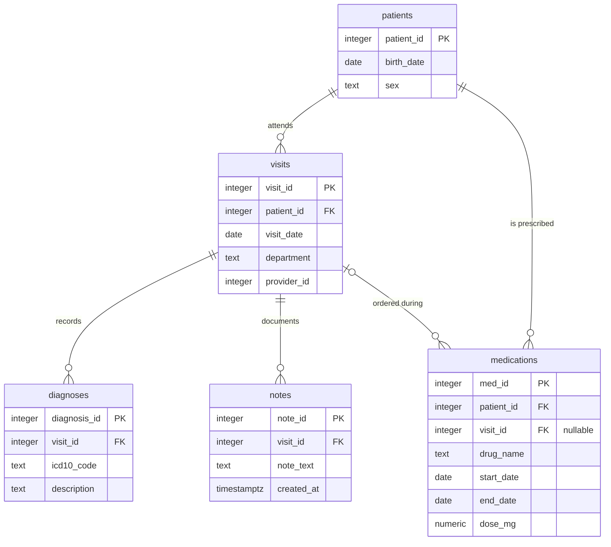

# Part 3 — SQL & Python Pipeline

<!-- ---------------------------------------------------------------------------
COMMENTS TO CLAUDE

Mark feedback inline, next to whatever it refers to, in this form:

    > **@claude:** rewrite this, it repeats the point above

Use `@claude` and nothing else — a different marker will be missed by the sweep:

    grep -n '@claude' results/*.md

These HTML comment blocks do not render, so they stay out of the submitted PDF.
---------------------------------------------------------------------------- -->

---

## Task 3.1 — SQL

### Entity-relationship diagram



DDL: [`sql/schema.sql`](../sql/schema.sql).

### Three things the diagram makes visible

**1. `medications` has two parents.** It carries both `patient_id` and `visit_id`, so it
hangs off `patients` directly *and* off `visits`. That is a deliberate denormalization —
it lets a prescription exist without an encounter (a phone renewal, a transferred
medication list) by leaving `visit_id` NULL. It also creates a consistency hazard the
schema cannot enforce: nothing stops `medications.patient_id` disagreeing with
`visits.patient_id` for the same row. In production that wants either a composite foreign
key or a `CHECK` trigger. It is also what forces query 3's join key.

**2. Diagnoses and notes hang off the *visit*, not the patient.** So any patient-level
question about diagnoses has to travel `patients → visits → diagnoses`. A patient with no
visits therefore has no diagnoses by construction, and patient-level counts are only as
complete as the visit records.

**3. There is no encounter-level uniqueness on `notes`.** Nothing prevents several notes
per visit, which is exactly the duplication query 5 has to resolve. The absence of a
constraint is the reason the query is needed.

### The queries

| # | Question | File | The decision that changes the answer |
| --- | --- | --- | --- |
| 1 | Distinct patients with ≥1 Neurology visit in 2025 | [`01_…`](../sql/queries/01_neurology_patients_2025.sql) | Half-open date range; department matched exactly, since `ILIKE '%neurolog%'` also catches *Neurosurgery* |
| 2 | Each patient's first-ever visit date and its department | [`02_…`](../sql/queries/02_first_visit_per_patient.sql) | `LEFT JOIN` so patients with no visits survive; ties broken on `visit_id` for determinism |
| 3 | G20 patients never prescribed a levodopa-containing drug | [`03_…`](../sql/queries/03_parkinsons_without_levodopa.sql) | `LIKE 'G20%'` so the query is correct under both WHO ICD-10 (no G20 children) and ICD-10-CM FY2024 (which retired the bare code for G20.A1/A2, G20.B1/B2, G20.C); joined via `medications.patient_id` so prescriptions with a NULL `visit_id` still count |
| 4 | Average diagnoses per visit, by department, 2025 | [`04_…`](../sql/queries/04_avg_diagnoses_per_visit_2025.sql) | `LEFT JOIN` so zero-diagnosis visits stay in the denominator; `::numeric` so 3/2 is not 1 |
| 5 | Exactly one row per visit: the most recent note | [`05_…`](../sql/queries/05_latest_note_per_visit.sql) | Tie-break on `note_id`, because identical timestamps are the signature of the double-submit that created the duplicates |

Each file's header carries the full assumptions, the rejected alternatives and the reasoning —
one place to read, one place to change.

One item is repeated here rather than left in its file, because it changes how the *output*
should be read: **query 3 over-reports** — `ILIKE '%levodopa%'` misses brand names, so a treated
patient can appear untreated.

### Unit tests

[`tests/test_sql_queries.py`](../tests/test_sql_queries.py) — 24 tests against a real
PostgreSQL cluster, aimed at boundaries rather than happy paths, because that is where a
plausible-looking query is wrong: 31 December vs 1 January, a patient with no visits, a visit
with no diagnoses, a prescription with a NULL `visit_id`, same-day visit ties, identical note
timestamps, and `Neurosurgery` not matching `Neurology`.

Four pin a decision rather than check correctness, so it cannot drift silently:
integer division must not truncate; the levodopa over-report above is asserted as current
behavior; and two guard query 2 — that its `DISTINCT ON` and `LATERAL` forms agree, and that
moving `LATERAL`'s correlation into the `ON` clause silently loses rows.

**How they run.** [`tests/conftest.py`](../tests/conftest.py) starts a throwaway cluster with
`initdb` in a temp directory, on a Unix socket only — no Docker, no port collisions, and no
pre-existing server required. Each test gets the schema applied inside a transaction that is
rolled back afterwards; since DDL is transactional in PostgreSQL, isolation is free. If the
PostgreSQL binaries are not on `PATH`, these tests **skip with a clear reason** rather than
failing.

```
uv run pytest tests/test_sql_queries.py -v
```

---

## Task 3.2 — Python evaluation pipeline

[`src/evaluate.py`](../src/evaluate.py) · run with `uv run python -m src.evaluate`
· tests: [`tests/test_evaluate.py`](../tests/test_evaluate.py) (21)

The property of the corpus that shaped this implementation: **62 of the 90 notes (69%) contain
no disease-status or progression vocabulary at all** — no "progressive disease", "PD", "stable
disease", "PR", "remission" or "no evidence of". They are consult letters, pre-operative notes
and procedure reports. So the abstention path is the common case here, not an edge case, and the
mock draws it for most notes accordingly.

### What the pipeline does

| Step | Function | Notes |
| --- | --- | --- |
| Random ground truth | `add_random_labels` | Seeded, fair coin, every record labeled — the literal reading of "a column of random binary labels". Prevalence and missing-label injection are keyword arguments for the tests, not CLI options, since neither is part of what 3.2 asks for. |
| Mock the model | `call_local_llm(text) -> dict` | The signature the assignment specifies. Deterministic per note. It simulates the *model*, so it emits the intermediate 0–100 contract; `verify_output` rescales to the 0.0–1.0 output schema (see 2.3). |
| Mock *messy* output | `call_local_llm_messy(text) -> str` | Fenced blocks, leading/trailing prose, truncation, invalid JSON, out-of-range confidence, unknown fields — drawn at fixed probabilities. |
| Run the pipeline | `classify_note` (Part 2) | **The shipped flow, not a copy of it** — see below. |
| Evaluate | `evaluate` | Confusion matrix, PD-class precision/recall/F1, ROC-AUC. Exactly the four 3.2 asks to be printed. |

**Why there are two mocks.** A mock that only ever returns a clean dict cannot test the parser,
and robust parsing is explicitly assessed. `call_local_llm` satisfies the required signature;
the messy variant supplies the malformed shapes. The mock also draws *real substrings* of each
note as evidence quotes — an invented quote would fail the grounding check for the wrong reason
and tell us nothing.

**The evaluation drives `classify_note`, not a reimplementation of it.** The mocks are wired in
as the stage-1 and stage-2 models, so the measured run exercises the real stage split, the
verdict-preservation check and the bounded repair loop — the same code path production uses,
with only the models swapped. Evaluating a lookalike would measure the wrong thing, and did:
an earlier version called the validator directly, skipping stage 4 entirely and reporting **22
failures where the actual pipeline has 6**, because 17 records are rescued by repair. Both mocks
derive from one seeded draw per note so the two stages agree, which is why verdict drift never
fires here — a mock whose stages disagreed would report drift on every record and tell us
nothing. Repair recovers most malformed output but not all (70%, deterministic per note); if it
recovered everything the failure tally would be empty, and 3.2 asks for failures counted by
type.

### Results (seed 20260819)

```
Failures by type                     Record accounting
  records: 90                          records in corpus            90
  valid:   84                          excluded - pipeline failed    6
  failed:  6                           excluded - no ground truth    0
    no_json_found:           3         evaluated                    84
    json_decode_error:       2         recovered by stage-4 repair  17
    schema_validation_error: 1         abstentions                  58

Confusion matrix                     PD-class metrics
                pred Non-PD  pred PD    precision  0.778
  true Non-PD            35        2    recall     0.149
  true PD                40        7    f1         0.250
                                        roc-auc    0.570
```

**These numbers measure the harness, not clinical accuracy** — the labels are random by
instruction, so no relationship to the predictions exists to be found. The output says so
explicitly, because a table of metrics with no such caveat invites exactly the
misinterpretation Q1.2f is about.

**How abstentions enter the ROC-AUC**, since it changes how the number reads.
`confidence_score` is confidence in *whichever* label was chosen, so P(PD) is `1 − confidence`
for a Non-PD prediction — but an abstention is `Non-PD` at *low* confidence, and that formula
would turn "the note says nothing" into "almost certainly PD". Abstentions are therefore scored
at a constant 0.5: they tie with each other and contribute no discrimination in either
direction, which is the honest encoding of "no evidence". That is why the selective-prediction
figure below, computed over the records the model actually committed on, is the more informative
of the two.

The number worth reading is **ROC-AUC 0.570** — close to 0.5, which is the right answer.
Against labels with no relationship to the input, a correct harness must find no
discrimination, so this is the strongest available evidence that the evaluation code measures
what it claims to. An AUC far from 0.5 here would be a signal to go looking for a bug, which is
how an earlier sign error in the abstention scoring was caught.

Precision 0.778 against recall 0.149 is the other thing to notice, and it is an artifact worth
naming: the mock abstains on most notes, so it predicts PD rarely. Predicting the positive class
rarely makes precision look good and recall terrible — the threshold effect discussed in 3.3
below, visible here by construction rather than by argument.

## Task 3.3 — Two written questions

### Records with no ground truth came through your SQL. How does your evaluation function handle them, and why does it matter?

They are **excluded from every metric and counted separately in the printed report**.
`evaluate()` partitions the corpus three ways — parse/validation failures, records with a null
label, and records actually evaluated — and prints all three counts above the metrics.
Crucially the two exclusion reasons are reported *separately*, because they have different
owners: a parse failure is a model or parser defect, a missing label is a data problem, and
collapsing them into one "skipped" number hides which team needs to act.

Why it matters, in order of severity:

**Unlabeled records are not a random sample.** They are frequently unlabeled *because* they
were hard — the annotator could not decide, the record was ambiguous, or a join upstream lost
it. Dropping them silently therefore removes disproportionately difficult cases and inflates
every metric. The measured score drifts away from production performance in the optimistic
direction, which is the worst direction for a clinical system.

**Imputing them is worse than dropping them.** Filling a missing label with the majority class
manufactures ground truth. At the ~5% clinical prevalence of Q1.2c, defaulting the unlabeled to Non-PD inflates
accuracy and specificity while corrupting recall, and the corruption is invisible because the
fabricated labels look like data.

**An unreported denominator makes the metric unreadable.** `F1 = 0.92` over 1,000 records and
over 60 records are different claims. Without the exclusion counts a reader cannot tell which
they are looking at, cannot compute a confidence interval, and cannot notice that half the
corpus vanished.

**The missingness rate is itself a monitoring signal.** A rising proportion of unlabeled
records means annotation is falling behind or a SQL join is silently dropping rows — the
latter being the failure mode the question's phrasing hints at. That deserves an alert, not a
`dropna()`.

**Practically**, NaN labels must also never reach scikit-learn: depending on the metric they
either raise or coerce into nonsense. Handling them explicitly at the boundary is what keeps a
silent `except: pass` out of the pipeline.

### Your ROC-AUC is 0.94 but F1 for the PD class is 0.61. Explain how both can be true at once, and what you would do about it.

**They measure different things, and only one of them involves a decision.** ROC-AUC is
threshold-free: it is the probability that a randomly chosen positive is ranked above a
randomly chosen negative. It measures *ordering* and is insensitive to prevalence. F1 is
computed at **one specific threshold** and depends on precision, which is acutely
prevalence-sensitive. So 0.94 says the model ranks well; 0.61 says the decision rule applied to
that ranking is poor. Both can be true simultaneously, and at low prevalence they routinely are.

A concrete illustration. Take 1,000 records with 50 positives (5%). Excellent ranking, AUC 0.94.
Threshold at the default 0.5 and you might get 40 TP, 60 FP, 10 FN — precision 0.40, recall
0.80, F1 0.53. The 60 false positives come from the top tail of 950 negatives; because
negatives outnumber positives 19:1, even a small false-positive *rate* produces an absolute
count that swamps precision. ROC-AUC never sees this, because its x-axis is a *rate* over that
huge negative pool. This is the same mechanism as the ROC-AUC critique in Q1.2c.

**What I would do, cheapest and most likely first:**

1. **Move the threshold before touching the model.** Sweep it on validation data and choose
   against the clinical false-negative-to-false-positive cost ratio rather than leaving it at
   0.5. When AUC is 0.94, most of the F1 gap is usually recoverable here alone, and it costs
   nothing.
2. **Read the precision-recall curve, not the ROC.** At 5% prevalence the PR curve is the
   informative one; it shows directly whether *any* operating point achieves acceptable
   precision, or whether the ranking is good but the top of it is contaminated.
3. **Check calibration.** ROC-AUC is invariant under any monotone transform of the scores, so a
   model can rank perfectly and still be badly calibrated — and a badly calibrated score makes
   every threshold choice wrong. Reliability diagram, ECE, Brier; then Platt scaling, which
   changes the thresholded metrics without changing AUC at all.
4. **Consider selective prediction.** With AUC 0.94 there is almost certainly a high-precision
   region. Report precision at fixed recall and the risk-coverage curve, and route the
   uncertain middle band to clinician review. This trades coverage for precision deliberately
   instead of accepting a bad F1 at full coverage.
5. **Audit the positive labels.** With few positives, a handful of incorrect gold labels moves
   F1 substantially while barely touching AUC. Re-adjudicate the false positives and false
   negatives with a clinician before concluding the model is at fault.
6. **Report confidence intervals on both.** F1 over a small positive class has a wide interval;
   0.61 may not be statistically distinguishable from 0.75, in which case some of the "gap"
   is noise. The run above reports a CI on both metrics for exactly this reason.
7. **Only then change the model.** Threshold, calibration and label quality account for this
   pattern far more often than model capacity does, and all three are cheaper to fix.

This pipeline shows the pattern in miniature: ROC-AUC **0.570** against an F1 of **0.250**,
with precision 0.778 and recall 0.149. The driver is abstention — most records carry no
evidence, so the model commits rarely, which flatters precision and destroys recall while
leaving the ranking largely intact. With random labels the magnitude is noise; the mechanism is
the point.
