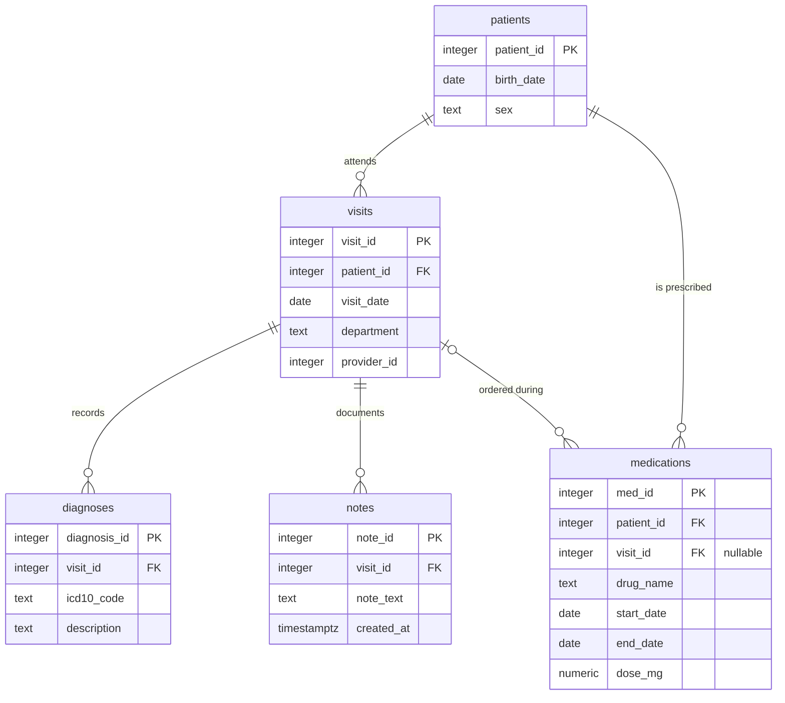

# Part 3 — SQL & Python Pipeline

<!-- ---------------------------------------------------------------------------
COMMENTS TO CLAUDE

Mark feedback inline, next to whatever it refers to, in this form:

    > **@claude:** rewrite this, it repeats the point above

Use `@claude` and nothing else — a different marker will be missed by the sweep:

    grep -n '@claude' results/*.md

These HTML comment blocks do not render, so they stay out of the submitted PDF.
---------------------------------------------------------------------------- -->

---

## Task 3.1 — SQL

### Entity-relationship diagram



DDL: [`sql/schema.sql`](../sql/schema.sql).

### Three things the diagram makes visible

**1. `medications` has two parents.** It carries both `patient_id` and `visit_id`, so it
hangs off `patients` directly *and* off `visits`. That is a deliberate denormalisation —
it lets a prescription exist without an encounter (a phone renewal, a transferred
medication list) by leaving `visit_id` NULL. It also creates a consistency hazard the
schema cannot enforce: nothing stops `medications.patient_id` disagreeing with
`visits.patient_id` for the same row. In production that wants either a composite foreign
key or a `CHECK` trigger. **It changes query 3**: "never prescribed" must be evaluated
through `medications.patient_id`, because joining via `visit_id` would silently miss every
prescription with a NULL visit.

**2. Diagnoses and notes hang off the *visit*, not the patient.** So any patient-level
question about diagnoses has to travel `patients → visits → diagnoses`. A patient with no
visits therefore has no diagnoses by construction, and patient-level counts are only as
complete as the visit records.

**3. There is no encounter-level uniqueness on `notes`.** Nothing prevents several notes
per visit, which is exactly the duplication query 5 has to resolve. The absence of a
constraint is the reason the query is needed.

### The queries

| # | Question | File |
| --- | --- | --- |
| 1 | Distinct patients with ≥1 Neurology visit in 2025 | [`01_neurology_patients_2025.sql`](../sql/queries/01_neurology_patients_2025.sql) |
| 2 | Each patient's first-ever visit date and its department | [`02_first_visit_per_patient.sql`](../sql/queries/02_first_visit_per_patient.sql) |
| 3 | G20 patients never prescribed a levodopa-containing drug | [`03_parkinsons_without_levodopa.sql`](../sql/queries/03_parkinsons_without_levodopa.sql) |
| 4 | Average diagnoses per visit, by department, 2025 | [`04_avg_diagnoses_per_visit_2025.sql`](../sql/queries/04_avg_diagnoses_per_visit_2025.sql) |
| 5 | Exactly one row per visit: the most recent note | [`05_latest_note_per_visit.sql`](../sql/queries/05_latest_note_per_visit.sql) |

Each file carries its own assumptions in a header comment. The ones that change the answer
rather than merely restating it:

**Query 1 — half-open date range.** `>= '2025-01-01' AND < '2026-01-01'` rather than
`BETWEEN '2025-01-01' AND '2025-12-31'`. The `BETWEEN` form is correct for a `date` column
but silently drops 31 December after midnight if the column is ever widened to a timestamp,
and the half-open form stays index-sargable. Department is matched exactly, because
`ILIKE '%neurolog%'` would also capture *Neurosurgery*.

**Query 2 — "every patient" is read literally.** A patient with no visits appears with
NULLs, via `LEFT JOIN LATERAL … LIMIT 1`. A `GROUP BY` over `visits` would silently drop
them and quietly answer a different question: "every patient *who has visited*". Ties on
`visit_date` break to the lower `visit_id`, so the result is deterministic — without a
tie-break, two visits on one day make the returned department arbitrary.

**Query 3 — `LIKE 'G20%'`, not `= 'G20'`.** ICD-10-CM split G20 into subcodes (G20.A1,
G20.B2, …) from FY2024, so an exact match silently misses patients coded under the newer
scheme. No sibling code shares the prefix, so this cannot over-match. *Stated limitation:*
`ILIKE '%levodopa%'` catches `Carbidopa-Levodopa` and `levodopa/benserazide` but **not**
brand names — `Sinemet`, `Madopar`, `Rytary`. The query therefore **over-reports**: a
patient on Sinemet appears untreated. A production version would resolve `drug_name`
against RxNorm ingredients or ATC N04BA instead of matching substrings. There is a test
pinning this behaviour, so switching to terminology matching will fail it and force the
note to be updated rather than left stale.

**Query 4 — visits with zero diagnoses stay in the denominator.** This is the whole
question. An `INNER JOIN` computes "diagnoses per visit *that had a diagnosis*", inflating
every department's average. The `LEFT JOIN` keeps the visit and contributes 0 to the
numerator. The `::numeric` cast prevents integer division truncating 3/2 to 1.

**Query 5 — ties on `created_at` break to the highest `note_id`.** Not a pedantic detail:
duplicate rows carrying *identical* timestamps is precisely the shape of a double-submit
bug, so ties are likely rather than hypothetical. `DISTINCT ON` is used as the idiomatic
PostgreSQL form, with a portable `ROW_NUMBER()` equivalent in the file's footer.

### Unit tests

[`tests/test_sql_queries.py`](../tests/test_sql_queries.py) — 20 tests, run against a real
PostgreSQL cluster. The tests target boundaries rather than happy paths, because that is
where a plausible-looking query is wrong: visits on 31 December vs 1 January, a patient with
no visits, a visit with no diagnoses, a prescription with a NULL `visit_id`, same-day visit
ties, identical note timestamps, and `Neurosurgery` not matching `Neurology`.

Two tests exist to pin decisions rather than to check correctness:
`test_integer_division_does_not_truncate` (3/2 must be 1.5) and
`test_known_limitation_brand_names_are_missed`, which asserts the documented over-report so
it cannot drift silently.

**How they run.** [`tests/conftest.py`](../tests/conftest.py) starts a throwaway cluster
with `initdb` in a temp directory, on a Unix socket only — no Docker, no port collisions,
and no pre-existing server required. Each test gets the schema applied inside a transaction
that is rolled back afterwards; since DDL is transactional in PostgreSQL, isolation is free.
If the PostgreSQL binaries are not on `PATH`, these tests **skip with a clear reason**
rather than failing, so the rest of the suite stays green on a machine without PostgreSQL.

```
uv run pytest tests/test_sql_queries.py -v
```

---

## Task 3.2 — Python evaluation pipeline

*Pending.*

## Task 3.3 — Two written questions

*Pending.*
