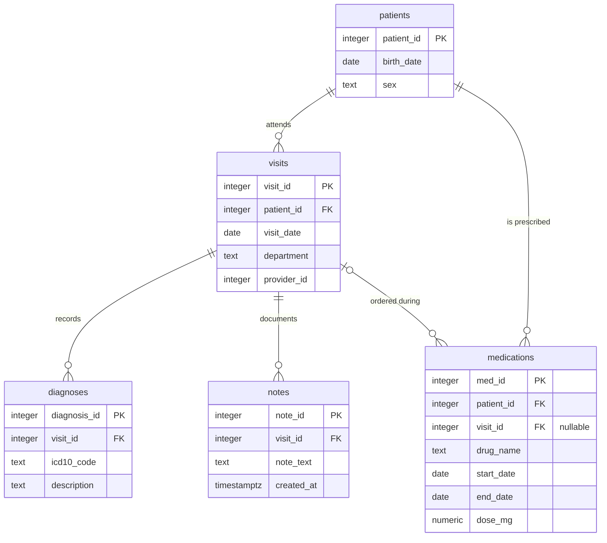

# Part 3 — SQL & Python Pipeline

<!-- ---------------------------------------------------------------------------
COMMENTS TO CLAUDE

Mark feedback inline, next to whatever it refers to, in this form:

    > **@claude:** rewrite this, it repeats the point above

Use `@claude` and nothing else — a different marker will be missed by the sweep:

    grep -n '@claude' results/*.md

These HTML comment blocks do not render, so they stay out of the submitted PDF.
---------------------------------------------------------------------------- -->

---

## Task 3.1 — SQL

### Entity-relationship diagram



DDL: [`sql/schema.sql`](../sql/schema.sql).

### Three things the diagram makes visible

**1. `medications` has two parents.** It carries both `patient_id` and `visit_id`, so it
hangs off `patients` directly *and* off `visits`. That is a deliberate denormalization —
it lets a prescription exist without an encounter (a phone renewal, a transferred
medication list) by leaving `visit_id` NULL. It also creates a consistency hazard the
schema cannot enforce: nothing stops `medications.patient_id` disagreeing with
`visits.patient_id` for the same row. In production that wants either a composite foreign
key or a `CHECK` trigger. It is also what forces query 3's join key.

**2. Diagnoses and notes hang off the *visit*, not the patient.** So any patient-level
question about diagnoses has to travel `patients → visits → diagnoses`. A patient with no
visits therefore has no diagnoses by construction, and patient-level counts are only as
complete as the visit records.

**3. There is no encounter-level uniqueness on `notes`.** Nothing prevents several notes
per visit, which is exactly the duplication query 5 has to resolve. The absence of a
constraint is the reason the query is needed.

### The queries

| # | Question | File | The decision that changes the answer |
| --- | --- | --- | --- |
| 1 | Distinct patients with ≥1 Neurology visit in 2025 | [`01_…`](../sql/queries/01_neurology_patients_2025.sql) | Half-open date range; department matched exactly, since `ILIKE '%neurolog%'` also catches *Neurosurgery* |
| 2 | Each patient's first-ever visit date and its department | [`02_…`](../sql/queries/02_first_visit_per_patient.sql) | `LEFT JOIN` so patients with no visits survive; ties broken on `visit_id` for determinism |
| 3 | G20 patients never prescribed a levodopa-containing drug | [`03_…`](../sql/queries/03_parkinsons_without_levodopa.sql) | `LIKE 'G20%'` so the query is correct under both WHO ICD-10 (no G20 children) and ICD-10-CM FY2024 (which retired the bare code for G20.A1/A2, G20.B1/B2, G20.C); joined via `medications.patient_id` so prescriptions with a NULL `visit_id` still count |
| 4 | Average diagnoses per visit, by department, 2025 | [`04_…`](../sql/queries/04_avg_diagnoses_per_visit_2025.sql) | `LEFT JOIN` so zero-diagnosis visits stay in the denominator; `::numeric` so 3/2 is not 1 |
| 5 | Exactly one row per visit: the most recent note | [`05_…`](../sql/queries/05_latest_note_per_visit.sql) | Tie-break on `note_id`, because identical timestamps are the signature of the double-submit that created the duplicates |

Each file's header carries the full assumptions, the rejected alternatives and the reasoning —
one place to read, one place to change.

One item is repeated here rather than left in its file, because it changes how the *output*
should be read: **query 3 over-reports** — `ILIKE '%levodopa%'` misses brand names, so a treated
patient can appear untreated.

### Unit tests

[`tests/test_sql_queries.py`](../tests/test_sql_queries.py) — 24 tests against a real
PostgreSQL cluster, aimed at boundaries rather than happy paths, because that is where a
plausible-looking query is wrong: 31 December vs 1 January, a patient with no visits, a visit
with no diagnoses, a prescription with a NULL `visit_id`, same-day visit ties, identical note
timestamps, and `Neurosurgery` not matching `Neurology`.

Four pin a decision rather than check correctness, so it cannot drift silently:
integer division must not truncate; the levodopa over-report above is asserted as current
behavior; and two guard query 2 — that its `DISTINCT ON` and `LATERAL` forms agree, and that
moving `LATERAL`'s correlation into the `ON` clause silently loses rows.

**How they run.** [`tests/conftest.py`](../tests/conftest.py) starts a throwaway cluster with
`initdb` in a temp directory, on a Unix socket only — no Docker, no port collisions, and no
pre-existing server required. Each test gets the schema applied inside a transaction that is
rolled back afterwards; since DDL is transactional in PostgreSQL, isolation is free. If the
PostgreSQL binaries are not on `PATH`, these tests **skip with a clear reason** rather than
failing.

```
uv run pytest tests/test_sql_queries.py -v
```

---

## Task 3.2 — Python evaluation pipeline

[`src/evaluate.py`](../src/evaluate.py) · `uv run samueli-evaluate` · 32 tests in
[`tests/test_evaluate.py`](../tests/test_evaluate.py)

Per note: draw a random label, pick a scenario, build the two stage responses and the retry
budget, run them through **`classify_note` from Part 2** — the shipped flow, not a copy of it —
then flatten the result. Print the four metrics 3.2 asks for.

The mock is driven by the scenarios from the walkthrough in [`src/demo.py`](../src/demo.py), so
the corpus run exercises the same stage paths the tour demonstrates:

| scenario | share | outcome |
| --- | ---: | --- |
| 1a contract met end to end | **55%** | success, no retries |
| 1b stage 1 omits its `VERDICT` line | 5% | `stage1_no_verdict`; stage 2 never called |
| 2a stage 2 fences its JSON, adds prose | 5% | success — the extractor absorbs it |
| 2b instruction-like text in stage 1's output | 5% | success — stage 2 reports it, does not obey |
| 3a + 4c stage 2 flips the verdict | 10% | `verdict_drift`, **0 repairs** — unrepairable by design |
| 3b quote absent from the note | 5% | `evidence_not_in_source` |
| 3c nothing assessable | 5% | success, flagged as an abstention |
| 4a truncated JSON | 5% | success, recovered on retry 1 |
| 4b never returns valid JSON | 5% | `no_json_found`, retries bounded |

That is why there is no probability table over malformed *shapes*: **"parse robustly" is the
pipeline's job**, and 2a / 4a / 4b exist to feed it those shapes. Each scenario's outcome and
retry count is asserted in `tests/test_evaluate.py`, so the failure mix below is a property of
this table rather than of tuning. Two simplifications follow from 3.2 evaluating the PD / Non-PD
decision and nothing else: the evidence quote is a slice of the note rather than a clinically
chosen span, and abstention comes from scenario 3c rather than from the note's vocabulary.

### Results (seed 20260819)

```
Failures by type                       Record accounting
  records: 90                            records in corpus            90
  valid:   67                            excluded - pipeline failed   23
  failed:  23                            excluded - no ground truth    0
    verdict_drift:           10          evaluated                    67
    stage1_no_verdict:        6          recovered by stage-4 repair   6
    no_json_found:            5          abstentions                   9
    evidence_not_in_source:   2

Confusion matrix                       PD-class metrics
                pred Non-PD  pred PD      precision  0.750
  true Non-PD            32        1      recall     0.088
  true PD                31        3      f1         0.158
                                          roc-auc    0.506
```

The labels are random, so **ROC-AUC near 0.5 is the correct outcome** — a harness that found
discrimination here would be broken. Abstentions score exactly 0.5 and contribute none. Nothing
else in this block is a performance claim: with PD predicted for 5% of notes, the PD-class
metrics rest on a handful of predictions, which is the low-prevalence problem 3.3 is about.

## Task 3.3 — Two written questions

### Records with no ground truth came through your SQL. How does your evaluation function handle them, and why does it matter?

**Excluded from every metric, and counted separately in the printed report.** `evaluate()`
partitions the corpus three ways — pipeline failures, null labels, evaluated — and prints all
three. The two exclusion reasons are kept apart because they have different owners: a pipeline
failure is a model or parser defect, a missing label is a data problem.

Why it matters:

- **They are not a random sample.** Records are often unlabeled *because* they were hard, so
  dropping them silently removes the difficult cases and inflates every metric — in the
  optimistic direction, which is the worst one for a clinical system.
- **Imputing is worse than dropping.** Filling with the majority class manufactures ground
  truth, and the corruption is invisible because fabricated labels look like data.
- **An unreported denominator makes the metric unreadable.** F1 = 0.92 over 1,000 records and
  over 60 records are different claims.
- **The missingness rate is itself a monitoring signal.** A rising share means annotation is
  falling behind, or a join is silently dropping rows — the failure the question hints at. That
  deserves an alert, not a `dropna()`.
- **Practically**, NaN must never reach scikit-learn: it either raises or coerces into nonsense.

### Your ROC-AUC is 0.94 but F1 for the PD class is 0.61. Explain how both can be true at once, and what you would do about it.

**They measure different things, and only one of them involves a decision.** ROC-AUC is
threshold-free — the probability a random positive outranks a random negative — and is
insensitive to prevalence. F1 is computed at **one threshold** and depends on precision, which is
acutely prevalence-sensitive. So 0.94 says the ranking is good; 0.61 says the decision rule
applied to that ranking is poor.

Concretely: 1,000 records, 50 positives. Threshold at 0.5 and you might get 40 TP, 60 FP, 10 FN —
precision 0.40, F1 0.53. Those 60 false positives come from the tail of **950** negatives, so a
small false-positive *rate* still yields an absolute count that swamps precision. ROC-AUC never
sees it, because its x-axis is a rate over that huge negative pool — the same mechanism as the
ROC-AUC critique in Q1.2c.

What I would do, cheapest first:

1. **Move the threshold**, chosen on validation data against the clinical FN:FP cost ratio rather
   than left at 0.5. Most of the gap is usually recoverable here, and it costs nothing.
2. **Read the PR curve (PR-AUC), not the ROC.** At 5% prevalence it shows directly whether *any*
   operating point reaches acceptable precision.
3. **Check calibration.** ROC-AUC is invariant under monotone transforms, so a model can rank
   perfectly and still be badly calibrated. Reliability diagram, ECE, Brier; then Platt scaling,
   which moves the thresholded metrics without changing AUC.
4. **Consider selective prediction.** At 0.94 there is almost certainly a high-precision region:
   report precision at fixed recall and route the uncertain band to clinician review.
5. **Audit the positive labels.** With few positives, a handful of wrong gold labels moves F1
   substantially while barely touching AUC.
6. **Report confidence intervals.** F1 over a small positive class has a wide one; 0.61 may not be
   distinguishable from 0.75, in which case part of the "gap" is noise.
7. **Only then change the model.** Threshold, calibration and label quality explain this pattern
   far more often than model capacity, and all three are cheaper to fix.
